```mermaid
flowchart TB
    subgraph upstream["Dependants (1)"]
        P1["<b>📦&nbsp;DasBlog.Web.csproj</b><br/><small>net8.0</small>"]
        click P1 "#dasblogwebdasblogwebcsproj"
    end
    subgraph current["DasBlog.CLI.csproj"]
        MAIN["<b>📦&nbsp;DasBlog.CLI.csproj</b><br/><small>net8.0</small>"]
        click MAIN "#dasblogclidasblogclicsproj"
    end
    subgraph downstream["Dependencies (1"]
        P6["<b>📦&nbsp;DasBlog.Services.csproj</b><br/><small>net8.0</small>"]
        click P6 "#dasblogservicesdasblogservicescsproj"
    end
    P1 --> MAIN
    MAIN --> P6

```

```mermaid
flowchart TB
    subgraph upstream["Dependants (4)"]
        P1["<b>📦&nbsp;DasBlog.Web.csproj</b><br/><small>net8.0</small>"]
        P2["<b>📦&nbsp;DasBlog.Managers.csproj</b><br/><small>net8.0</small>"]
        P4["<b>📦&nbsp;DasBlog.Tests.UnitTests.csproj</b><br/><small>net8.0</small>"]
        P6["<b>📦&nbsp;DasBlog.Services.csproj</b><br/><small>net8.0</small>"]
        click P1 "#dasblogwebdasblogwebcsproj"
        click P2 "#dasblogmanagersdasblogmanagerscsproj"
        click P4 "#dasblogtestsunittestsdasblogtestsunittestscsproj"
        click P6 "#dasblogservicesdasblogservicescsproj"
    end
    subgraph current["DasBlog.Core.csproj"]
        MAIN["<b>📦&nbsp;DasBlog.Core.csproj</b><br/><small>net8.0</small>"]
        click MAIN "#dasblogcoredasblogcorecsproj"
    end
    subgraph downstream["Dependencies (1"]
        P5["<b>📦&nbsp;newtelligence.DasBlog.Runtime.csproj</b><br/><small>net8.0</small>"]
        click P5 "#newtelligencedasblogruntimenewtelligencedasblogruntimecsproj"
    end
    P1 --> MAIN
    P2 --> MAIN
    P4 --> MAIN
    P6 --> MAIN
    MAIN --> P5

```

```mermaid
flowchart TB
    subgraph upstream["Dependants (2)"]
        P1["<b>📦&nbsp;DasBlog.Web.csproj</b><br/><small>net8.0</small>"]
        P4["<b>📦&nbsp;DasBlog.Tests.UnitTests.csproj</b><br/><small>net8.0</small>"]
        click P1 "#dasblogwebdasblogwebcsproj"
        click P4 "#dasblogtestsunittestsdasblogtestsunittestscsproj"
    end
    subgraph current["DasBlog.Managers.csproj"]
        MAIN["<b>📦&nbsp;DasBlog.Managers.csproj</b><br/><small>net8.0</small>"]
        click MAIN "#dasblogmanagersdasblogmanagerscsproj"
    end
    subgraph downstream["Dependencies (3"]
        P5["<b>📦&nbsp;newtelligence.DasBlog.Runtime.csproj</b><br/><small>net8.0</small>"]
        P6["<b>📦&nbsp;DasBlog.Services.csproj</b><br/><small>net8.0</small>"]
        P3["<b>📦&nbsp;DasBlog.Core.csproj</b><br/><small>net8.0</small>"]
        click P5 "#newtelligencedasblogruntimenewtelligencedasblogruntimecsproj"
        click P6 "#dasblogservicesdasblogservicescsproj"
        click P3 "#dasblogcoredasblogcorecsproj"
    end
    P1 --> MAIN
    P4 --> MAIN
    MAIN --> P5
    MAIN --> P6
    MAIN --> P3

```

```mermaid
flowchart TB
    subgraph upstream["Dependants (4)"]
        P1["<b>📦&nbsp;DasBlog.Web.csproj</b><br/><small>net8.0</small>"]
        P2["<b>📦&nbsp;DasBlog.Managers.csproj</b><br/><small>net8.0</small>"]
        P4["<b>📦&nbsp;DasBlog.Tests.UnitTests.csproj</b><br/><small>net8.0</small>"]
        P8["<b>📦&nbsp;DasBlog.CLI.csproj</b><br/><small>net8.0</small>"]
        click P1 "#dasblogwebdasblogwebcsproj"
        click P2 "#dasblogmanagersdasblogmanagerscsproj"
        click P4 "#dasblogtestsunittestsdasblogtestsunittestscsproj"
        click P8 "#dasblogclidasblogclicsproj"
    end
    subgraph current["DasBlog.Services.csproj"]
        MAIN["<b>📦&nbsp;DasBlog.Services.csproj</b><br/><small>net8.0</small>"]
        click MAIN "#dasblogservicesdasblogservicescsproj"
    end
    subgraph downstream["Dependencies (1"]
        P3["<b>📦&nbsp;DasBlog.Core.csproj</b><br/><small>net8.0</small>"]
        click P3 "#dasblogcoredasblogcorecsproj"
    end
    P1 --> MAIN
    P2 --> MAIN
    P4 --> MAIN
    P8 --> MAIN
    MAIN --> P3

```

```mermaid
flowchart TB
    subgraph current["DasBlog.Test.Integration.csproj"]
        MAIN["<b>📦&nbsp;DasBlog.Test.Integration.csproj</b><br/><small>net8.0</small>"]
        click MAIN "#dasblogtestsdasblogtestintegrationdasblogtestintegrationcsproj"
    end
    subgraph downstream["Dependencies (1"]
        P1["<b>📦&nbsp;DasBlog.Web.csproj</b><br/><small>net8.0</small>"]
        click P1 "#dasblogwebdasblogwebcsproj"
    end
    MAIN --> P1

```

```mermaid
flowchart TB
    subgraph current["DasBlog.Tests.UnitTests.csproj"]
        MAIN["<b>📦&nbsp;DasBlog.Tests.UnitTests.csproj</b><br/><small>net8.0</small>"]
        click MAIN "#dasblogtestsunittestsdasblogtestsunittestscsproj"
    end
    subgraph downstream["Dependencies (4"]
        P3["<b>📦&nbsp;DasBlog.Core.csproj</b><br/><small>net8.0</small>"]
        P1["<b>📦&nbsp;DasBlog.Web.csproj</b><br/><small>net8.0</small>"]
        P6["<b>📦&nbsp;DasBlog.Services.csproj</b><br/><small>net8.0</small>"]
        P2["<b>📦&nbsp;DasBlog.Managers.csproj</b><br/><small>net8.0</small>"]
        click P3 "#dasblogcoredasblogcorecsproj"
        click P1 "#dasblogwebdasblogwebcsproj"
        click P6 "#dasblogservicesdasblogservicescsproj"
        click P2 "#dasblogmanagersdasblogmanagerscsproj"
    end
    MAIN --> P3
    MAIN --> P1
    MAIN --> P6
    MAIN --> P2

```

```mermaid
flowchart TB
    subgraph upstream["Dependants (2)"]
        P4["<b>📦&nbsp;DasBlog.Tests.UnitTests.csproj</b><br/><small>net8.0</small>"]
        P7["<b>📦&nbsp;DasBlog.Test.Integration.csproj</b><br/><small>net8.0</small>"]
        click P4 "#dasblogtestsunittestsdasblogtestsunittestscsproj"
        click P7 "#dasblogtestsdasblogtestintegrationdasblogtestintegrationcsproj"
    end
    subgraph current["DasBlog.Web.csproj"]
        MAIN["<b>📦&nbsp;DasBlog.Web.csproj</b><br/><small>net8.0</small>"]
        click MAIN "#dasblogwebdasblogwebcsproj"
    end
    subgraph downstream["Dependencies (4"]
        P2["<b>📦&nbsp;DasBlog.Managers.csproj</b><br/><small>net8.0</small>"]
        P6["<b>📦&nbsp;DasBlog.Services.csproj</b><br/><small>net8.0</small>"]
        P8["<b>📦&nbsp;DasBlog.CLI.csproj</b><br/><small>net8.0</small>"]
        P3["<b>📦&nbsp;DasBlog.Core.csproj</b><br/><small>net8.0</small>"]
        click P2 "#dasblogmanagersdasblogmanagerscsproj"
        click P6 "#dasblogservicesdasblogservicescsproj"
        click P8 "#dasblogclidasblogclicsproj"
        click P3 "#dasblogcoredasblogcorecsproj"
    end
    P4 --> MAIN
    P7 --> MAIN
    MAIN --> P2
    MAIN --> P6
    MAIN --> P8
    MAIN --> P3

```

```mermaid
flowchart TB
    subgraph upstream["Dependants (2)"]
        P2["<b>📦&nbsp;DasBlog.Managers.csproj</b><br/><small>net8.0</small>"]
        P3["<b>📦&nbsp;DasBlog.Core.csproj</b><br/><small>net8.0</small>"]
        click P2 "#dasblogmanagersdasblogmanagerscsproj"
        click P3 "#dasblogcoredasblogcorecsproj"
    end
    subgraph current["newtelligence.DasBlog.Runtime.csproj"]
        MAIN["<b>📦&nbsp;newtelligence.DasBlog.Runtime.csproj</b><br/><small>net8.0</small>"]
        click MAIN "#newtelligencedasblogruntimenewtelligencedasblogruntimecsproj"
    end
    P2 --> MAIN
    P3 --> MAIN

```

# Projects and dependencies analysis

This document provides a comprehensive overview of the projects and their dependencies in the context of upgrading to .NETCoreApp,Version=v10.0.

## Table of Contents

- [Executive Summary](#executive-Summary)
  - [Highlevel Metrics](#highlevel-metrics)
  - [Projects Compatibility](#projects-compatibility)
  - [Package Compatibility](#package-compatibility)
  - [API Compatibility](#api-compatibility)
- [Aggregate NuGet packages details](#aggregate-nuget-packages-details)
- [Top API Migration Challenges](#top-api-migration-challenges)
  - [Technologies and Features](#technologies-and-features)
  - [Most Frequent API Issues](#most-frequent-api-issues)
- [Projects Relationship Graph](#projects-relationship-graph)
- [Project Details](#project-details)

  - [DasBlog.CLI\DasBlog.CLI.csproj](#dasblogclidasblogclicsproj)
  - [DasBlog.Core\DasBlog.Core.csproj](#dasblogcoredasblogcorecsproj)
  - [DasBlog.Managers\DasBlog.Managers.csproj](#dasblogmanagersdasblogmanagerscsproj)
  - [DasBlog.Services\DasBlog.Services.csproj](#dasblogservicesdasblogservicescsproj)
  - [DasBlog.Tests\DasBlog.Test.Integration\DasBlog.Test.Integration.csproj](#dasblogtestsdasblogtestintegrationdasblogtestintegrationcsproj)
  - [DasBlog.Tests\UnitTests\DasBlog.Tests.UnitTests.csproj](#dasblogtestsunittestsdasblogtestsunittestscsproj)
  - [DasBlog.Web\DasBlog.Web.csproj](#dasblogwebdasblogwebcsproj)
  - [newtelligence.DasBlog.Runtime\newtelligence.DasBlog.Runtime.csproj](#newtelligencedasblogruntimenewtelligencedasblogruntimecsproj)

## Executive Summary

### Highlevel Metrics

| Metric | Count | Status |
| :--- | :---: | :--- |
| Total Projects | 8 | All require upgrade |
| Total NuGet Packages | 33 | 11 need upgrade |
| Total Code Files | 443 |  |
| Total Code Files with Incidents | 37 |  |
| Total Lines of Code | 46356 |  |
| Total Number of Issues | 210 |  |
| Estimated LOC to modify | 188+ | at least 0.4% of codebase |

### Projects Compatibility

| Project | Target Framework | Difficulty | Package Issues | API Issues | Est. LOC Impact | Description |
| :--- | :---: | :---: | :---: | :---: | :---: | :--- |
| [DasBlog.CLI\DasBlog.CLI.csproj](#dasblogclidasblogclicsproj) | net8.0 | 🟢 Low | 5 | 3 | 3+ | DotNetCoreApp, Sdk Style = True |
| [DasBlog.Core\DasBlog.Core.csproj](#dasblogcoredasblogcorecsproj) | net8.0 | 🟢 Low | 1 | 0 |  | ClassLibrary, Sdk Style = True |
| [DasBlog.Managers\DasBlog.Managers.csproj](#dasblogmanagersdasblogmanagerscsproj) | net8.0 | 🟢 Low | 0 | 71 | 71+ | ClassLibrary, Sdk Style = True |
| [DasBlog.Services\DasBlog.Services.csproj](#dasblogservicesdasblogservicescsproj) | net8.0 | 🟢 Low | 1 | 48 | 48+ | ClassLibrary, Sdk Style = True |
| [DasBlog.Tests\DasBlog.Test.Integration\DasBlog.Test.Integration.csproj](#dasblogtestsdasblogtestintegrationdasblogtestintegrationcsproj) | net8.0 | 🟢 Low | 1 | 6 | 6+ | DotNetCoreApp, Sdk Style = True |
| [DasBlog.Tests\UnitTests\DasBlog.Tests.UnitTests.csproj](#dasblogtestsunittestsdasblogtestsunittestscsproj) | net8.0 | 🟢 Low | 0 | 1 | 1+ | AspNetCore, Sdk Style = True |
| [DasBlog.Web\DasBlog.Web.csproj](#dasblogwebdasblogwebcsproj) | net8.0 | 🟢 Low | 6 | 33 | 33+ | AspNetCore, Sdk Style = True |
| [newtelligence.DasBlog.Runtime\newtelligence.DasBlog.Runtime.csproj](#newtelligencedasblogruntimenewtelligencedasblogruntimecsproj) | net8.0 | 🟢 Low | 0 | 26 | 26+ | ClassLibrary, Sdk Style = True |

### Package Compatibility

| Status | Count | Percentage |
| :--- | :---: | :---: |
| ✅ Compatible | 22 | 66.7% |
| ⚠️ Incompatible | 2 | 6.1% |
| 🔄 Upgrade Recommended | 9 | 27.3% |
| ***Total NuGet Packages*** | ***33*** | ***100%*** |

### API Compatibility

| Category | Count | Impact |
| :--- | :---: | :--- |
| 🔴 Binary Incompatible | 12 | High - Require code changes |
| 🟡 Source Incompatible | 13 | Medium - Needs re-compilation and potential conflicting API error fixing |
| 🔵 Behavioral change | 163 | Low - Behavioral changes that may require testing at runtime |
| ✅ Compatible | 64546 |  |
| ***Total APIs Analyzed*** | ***64734*** |  |

## Aggregate NuGet packages details

| Package | Current Version | Suggested Version | Projects | Description |
| :--- | :---: | :---: | :--- | :--- |
| AutoMapper | 13.0.1 |  | [DasBlog.Web.csproj](#dasblogwebdasblogwebcsproj) | ✅Compatible |
| ConsoleTables | 2.6.2 |  | [DasBlog.CLI.csproj](#dasblogclidasblogclicsproj) | ✅Compatible |
| Coravel | 6.0.0 |  | [DasBlog.Services.csproj](#dasblogservicesdasblogservicescsproj) [DasBlog.Web.csproj](#dasblogwebdasblogwebcsproj) | ✅Compatible |
| coverlet.collector | 6.0.2 |  | [DasBlog.Test.Integration.csproj](#dasblogtestsdasblogtestintegrationdasblogtestintegrationcsproj) | ✅Compatible |
| HtmlAgilityPack | 1.11.71 |  | [DasBlog.Services.csproj](#dasblogservicesdasblogservicescsproj) | ✅Compatible |
| Kveer.XmlRPC | 1.3.1 |  | [DasBlog.Services.csproj](#dasblogservicesdasblogservicescsproj) | ✅Compatible |
| MailKit | 4.8.0 |  | [DasBlog.Services.csproj](#dasblogservicesdasblogservicescsproj) | ✅Compatible |
| Markdig | 0.38.0 |  | [DasBlog.Web.csproj](#dasblogwebdasblogwebcsproj) | ✅Compatible |
| McMaster.Extensions.CommandLineUtils | 4.1.1 |  | [DasBlog.CLI.csproj](#dasblogclidasblogclicsproj) | ✅Compatible |
| Microsoft.ApplicationInsights.AspNetCore | 2.22.0 |  | [DasBlog.Web.csproj](#dasblogwebdasblogwebcsproj) | ⚠️NuGet package is deprecated |
| Microsoft.AspNetCore.Identity.EntityFrameworkCore | 8.0.10 | 10.0.3 | [DasBlog.Web.csproj](#dasblogwebdasblogwebcsproj) | NuGet package upgrade is recommended |
| Microsoft.AspNetCore.Mvc.Razor.Extensions | 6.0.36 |  | [DasBlog.Web.csproj](#dasblogwebdasblogwebcsproj) | NuGet package functionality is included with framework reference |
| Microsoft.AspNetCore.Mvc.Razor.RuntimeCompilation | 8.0.10 | 10.0.3 | [DasBlog.Web.csproj](#dasblogwebdasblogwebcsproj) | NuGet package upgrade is recommended |
| Microsoft.AspNetCore.Mvc.Testing | 8.0.10 | 10.0.3 | [DasBlog.Test.Integration.csproj](#dasblogtestsdasblogtestintegrationdasblogtestintegrationcsproj) | NuGet package upgrade is recommended |
| Microsoft.Extensions.Configuration | 8.0.0 | 10.0.3 | [DasBlog.CLI.csproj](#dasblogclidasblogclicsproj) | NuGet package upgrade is recommended |
| Microsoft.Extensions.Configuration.Xml | 8.0.1 | 10.0.3 | [DasBlog.CLI.csproj](#dasblogclidasblogclicsproj) | NuGet package upgrade is recommended |
| Microsoft.Extensions.DependencyInjection | 8.0.1 | 10.0.3 | [DasBlog.CLI.csproj](#dasblogclidasblogclicsproj) | NuGet package upgrade is recommended |
| Microsoft.Extensions.DependencyInjection.Abstractions | 8.0.2 | 10.0.3 | [DasBlog.CLI.csproj](#dasblogclidasblogclicsproj) | NuGet package upgrade is recommended |
| Microsoft.Extensions.Options | 8.0.2 | 10.0.3 | [DasBlog.CLI.csproj](#dasblogclidasblogclicsproj) [DasBlog.Core.csproj](#dasblogcoredasblogcorecsproj) [DasBlog.Services.csproj](#dasblogservicesdasblogservicescsproj) | NuGet package upgrade is recommended |
| Microsoft.NET.Test.Sdk | 17.11.1 |  | [DasBlog.Test.Integration.csproj](#dasblogtestsdasblogtestintegrationdasblogtestintegrationcsproj) [DasBlog.Tests.UnitTests.csproj](#dasblogtestsunittestsdasblogtestsunittestscsproj) | ✅Compatible |
| Microsoft.Playwright | 1.48.0 |  | [DasBlog.Test.Integration.csproj](#dasblogtestsdasblogtestintegrationdasblogtestintegrationcsproj) | ✅Compatible |
| Microsoft.SourceLink.GitHub | 8.0.0 |  | [DasBlog.CLI.csproj](#dasblogclidasblogclicsproj) [DasBlog.Core.csproj](#dasblogcoredasblogcorecsproj) [DasBlog.Managers.csproj](#dasblogmanagersdasblogmanagerscsproj) [DasBlog.Services.csproj](#dasblogservicesdasblogservicescsproj) [DasBlog.Web.csproj](#dasblogwebdasblogwebcsproj) [newtelligence.DasBlog.Runtime.csproj](#newtelligencedasblogruntimenewtelligencedasblogruntimecsproj) | ✅Compatible |
| Microsoft.VisualStudio.Azure.Containers.Tools.Targets | 1.21.0 |  | [DasBlog.Web.csproj](#dasblogwebdasblogwebcsproj) | ⚠️NuGet package is incompatible |
| Microsoft.VisualStudio.Web.CodeGeneration.Design | 8.0.6 | 10.0.2 | [DasBlog.Web.csproj](#dasblogwebdasblogwebcsproj) | NuGet package upgrade is recommended |
| Moq | 4.20.72 |  | [DasBlog.Tests.UnitTests.csproj](#dasblogtestsunittestsdasblogtestsunittestscsproj) | ✅Compatible |
| NetEscapades.Extensions.Logging.RollingFile | 2.5.0 |  | [DasBlog.Core.csproj](#dasblogcoredasblogcorecsproj) [DasBlog.Web.csproj](#dasblogwebdasblogwebcsproj) | ✅Compatible |
| NodaTime | 3.2.0 |  | [DasBlog.Core.csproj](#dasblogcoredasblogcorecsproj) [DasBlog.Managers.csproj](#dasblogmanagersdasblogmanagerscsproj) [newtelligence.DasBlog.Runtime.csproj](#newtelligencedasblogruntimenewtelligencedasblogruntimecsproj) | ✅Compatible |
| NWebsec.AspNetCore.Middleware | 3.0.0 |  | [DasBlog.Web.csproj](#dasblogwebdasblogwebcsproj) | ✅Compatible |
| Quartz.AspNetCore | 3.13.1 |  | [DasBlog.Services.csproj](#dasblogservicesdasblogservicescsproj) [DasBlog.Web.csproj](#dasblogwebdasblogwebcsproj) | ✅Compatible |
| reCAPTCHA.AspNetCore | 3.0.10 |  | [DasBlog.Web.csproj](#dasblogwebdasblogwebcsproj) | ✅Compatible |
| xunit | 2.9.2 |  | [DasBlog.Test.Integration.csproj](#dasblogtestsdasblogtestintegrationdasblogtestintegrationcsproj) [DasBlog.Tests.UnitTests.csproj](#dasblogtestsunittestsdasblogtestsunittestscsproj) | ✅Compatible |
| xunit.runner.visualstudio | 2.8.2 |  | [DasBlog.Test.Integration.csproj](#dasblogtestsdasblogtestintegrationdasblogtestintegrationcsproj) [DasBlog.Tests.UnitTests.csproj](#dasblogtestsunittestsdasblogtestsunittestscsproj) | ✅Compatible |
| Xunit.SkippableFact | 1.4.13 |  | [DasBlog.Test.Integration.csproj](#dasblogtestsdasblogtestintegrationdasblogtestintegrationcsproj) | ✅Compatible |

## Top API Migration Challenges

### Technologies and Features

| Technology | Issues | Percentage | Migration Path |
| :--- | :---: | :---: | :--- |

### Most Frequent API Issues

| API | Count | Percentage | Category |
| :--- | :---: | :---: | :--- |
| T:System.Uri | 69 | 36.7% | Behavioral Change |
| M:System.Uri.#ctor(System.String) | 26 | 13.8% | Behavioral Change |
| M:System.Uri.#ctor(System.Uri,System.String) | 20 | 10.6% | Behavioral Change |
| P:System.Uri.AbsoluteUri | 18 | 9.6% | Behavioral Change |
| T:System.Xml.Serialization.XmlSerializer | 14 | 7.4% | Behavioral Change |
| T:System.Net.Http.HttpContent | 9 | 4.8% | Behavioral Change |
| M:Microsoft.Extensions.DependencyInjection.OptionsConfigurationServiceCollectionExtensions.Configure''1(Microsoft.Extensions.DependencyInjection.IServiceCollection,Microsoft.Extensions.Configuration.IConfiguration) | 6 | 3.2% | Binary Incompatible |
| M:Microsoft.Extensions.Configuration.ConfigurationBinder.GetValue''1(Microsoft.Extensions.Configuration.IConfiguration,System.String) | 5 | 2.7% | Binary Incompatible |
| M:System.TimeSpan.FromMilliseconds(System.Double) | 5 | 2.7% | Source Incompatible |
| M:System.Environment.SetEnvironmentVariable(System.String,System.String) | 2 | 1.1% | Behavioral Change |
| M:System.TimeSpan.FromMinutes(System.Double) | 2 | 1.1% | Source Incompatible |
| M:System.TimeSpan.FromSeconds(System.Double) | 2 | 1.1% | Source Incompatible |
| M:System.Net.Http.HttpContent.ReadAsStreamAsync | 1 | 0.5% | Behavioral Change |
| M:System.TimeSpan.FromDays(System.Double) | 1 | 0.5% | Source Incompatible |
| M:Microsoft.AspNetCore.Identity.EntityFrameworkCore.IdentityDbContext.#ctor | 1 | 0.5% | Source Incompatible |
| T:Microsoft.AspNetCore.Identity.EntityFrameworkCore.IdentityDbContext | 1 | 0.5% | Source Incompatible |
| M:Microsoft.Extensions.DependencyInjection.RazorRuntimeCompilationMvcBuilderExtensions.AddRazorRuntimeCompilation(Microsoft.Extensions.DependencyInjection.IMvcBuilder) | 1 | 0.5% | Source Incompatible |
| T:Microsoft.Extensions.DependencyInjection.ServiceCollectionExtensions | 1 | 0.5% | Binary Incompatible |
| M:Microsoft.AspNetCore.Builder.ForwardedHeadersExtensions.UseForwardedHeaders(Microsoft.AspNetCore.Builder.IApplicationBuilder) | 1 | 0.5% | Behavioral Change |
| P:System.Uri.AbsolutePath | 1 | 0.5% | Behavioral Change |
| M:Microsoft.AspNetCore.Builder.ExceptionHandlerExtensions.UseExceptionHandler(Microsoft.AspNetCore.Builder.IApplicationBuilder,System.String) | 1 | 0.5% | Behavioral Change |
| M:System.Uri.#ctor(System.String,System.UriKind) | 1 | 0.5% | Behavioral Change |

## Projects Relationship Graph

Legend:
📦 SDK-style project
⚙️ Classic project

```mermaid
flowchart LR
    P1["<b>📦&nbsp;DasBlog.Web.csproj</b><br/><small>net8.0</small>"]
    P2["<b>📦&nbsp;DasBlog.Managers.csproj</b><br/><small>net8.0</small>"]
    P3["<b>📦&nbsp;DasBlog.Core.csproj</b><br/><small>net8.0</small>"]
    P4["<b>📦&nbsp;DasBlog.Tests.UnitTests.csproj</b><br/><small>net8.0</small>"]
    P5["<b>📦&nbsp;newtelligence.DasBlog.Runtime.csproj</b><br/><small>net8.0</small>"]
    P6["<b>📦&nbsp;DasBlog.Services.csproj</b><br/><small>net8.0</small>"]
    P7["<b>📦&nbsp;DasBlog.Test.Integration.csproj</b><br/><small>net8.0</small>"]
    P8["<b>📦&nbsp;DasBlog.CLI.csproj</b><br/><small>net8.0</small>"]
    P1 --> P2
    P1 --> P6
    P1 --> P8
    P1 --> P3
    P2 --> P5
    P2 --> P6
    P2 --> P3
    P3 --> P5
    P4 --> P3
    P4 --> P1
    P4 --> P6
    P4 --> P2
    P6 --> P3
    P7 --> P1
    P8 --> P6
    click P1 "#dasblogwebdasblogwebcsproj"
    click P2 "#dasblogmanagersdasblogmanagerscsproj"
    click P3 "#dasblogcoredasblogcorecsproj"
    click P4 "#dasblogtestsunittestsdasblogtestsunittestscsproj"
    click P5 "#newtelligencedasblogruntimenewtelligencedasblogruntimecsproj"
    click P6 "#dasblogservicesdasblogservicescsproj"
    click P7 "#dasblogtestsdasblogtestintegrationdasblogtestintegrationcsproj"
    click P8 "#dasblogclidasblogclicsproj"

```

## Project Details

### DasBlog.CLI\DasBlog.CLI.csproj

#### Project Info

- **Current Target Framework:** net8.0
- **Proposed Target Framework:** net10.0
- **SDK-style**: True
- **Project Kind:** DotNetCoreApp
- **Dependencies**: 1
- **Dependants**: 1
- **Number of Files**: 3
- **Number of Files with Incidents**: 2
- **Lines of Code**: 430
- **Estimated LOC to modify**: 3+ (at least 0.7% of the project)

#### Dependency Graph

Legend:
📦 SDK-style project
⚙️ Classic project

### API Compatibility

| Category | Count | Impact |
| :--- | :---: | :--- |
| 🔴 Binary Incompatible | 1 | High - Require code changes |
| 🟡 Source Incompatible | 0 | Medium - Needs re-compilation and potential conflicting API error fixing |
| 🔵 Behavioral change | 2 | Low - Behavioral changes that may require testing at runtime |
| ✅ Compatible | 674 |  |
| ***Total APIs Analyzed*** | ***677*** |  |

### DasBlog.Core\DasBlog.Core.csproj

#### Project Info

- **Current Target Framework:** net8.0
- **Proposed Target Framework:** net10.0
- **SDK-style**: True
- **Project Kind:** ClassLibrary
- **Dependencies**: 1
- **Dependants**: 4
- **Number of Files**: 18
- **Number of Files with Incidents**: 1
- **Lines of Code**: 1575
- **Estimated LOC to modify**: 0+ (at least 0.0% of the project)

#### Dependency Graph

Legend:
📦 SDK-style project
⚙️ Classic project

### API Compatibility

| Category | Count | Impact |
| :--- | :---: | :--- |
| 🔴 Binary Incompatible | 0 | High - Require code changes |
| 🟡 Source Incompatible | 0 | Medium - Needs re-compilation and potential conflicting API error fixing |
| 🔵 Behavioral change | 0 | Low - Behavioral changes that may require testing at runtime |
| ✅ Compatible | 1129 |  |
| ***Total APIs Analyzed*** | ***1129*** |  |

### DasBlog.Managers\DasBlog.Managers.csproj

#### Project Info

- **Current Target Framework:** net8.0
- **Proposed Target Framework:** net10.0
- **SDK-style**: True
- **Project Kind:** ClassLibrary
- **Dependencies**: 3
- **Dependants**: 2
- **Number of Files**: 22
- **Number of Files with Incidents**: 4
- **Lines of Code**: 2564
- **Estimated LOC to modify**: 71+ (at least 2.8% of the project)

#### Dependency Graph

Legend:
📦 SDK-style project
⚙️ Classic project

### API Compatibility

| Category | Count | Impact |
| :--- | :---: | :--- |
| 🔴 Binary Incompatible | 0 | High - Require code changes |
| 🟡 Source Incompatible | 0 | Medium - Needs re-compilation and potential conflicting API error fixing |
| 🔵 Behavioral change | 71 | Low - Behavioral changes that may require testing at runtime |
| ✅ Compatible | 2011 |  |
| ***Total APIs Analyzed*** | ***2082*** |  |

### DasBlog.Services\DasBlog.Services.csproj

#### Project Info

- **Current Target Framework:** net8.0
- **Proposed Target Framework:** net10.0
- **SDK-style**: True
- **Project Kind:** ClassLibrary
- **Dependencies**: 1
- **Dependants**: 4
- **Number of Files**: 77
- **Number of Files with Incidents**: 10
- **Lines of Code**: 6428
- **Estimated LOC to modify**: 48+ (at least 0.7% of the project)

#### Dependency Graph

Legend:
📦 SDK-style project
⚙️ Classic project

### API Compatibility

| Category | Count | Impact |
| :--- | :---: | :--- |
| 🔴 Binary Incompatible | 4 | High - Require code changes |
| 🟡 Source Incompatible | 2 | Medium - Needs re-compilation and potential conflicting API error fixing |
| 🔵 Behavioral change | 42 | Low - Behavioral changes that may require testing at runtime |
| ✅ Compatible | 5036 |  |
| ***Total APIs Analyzed*** | ***5084*** |  |

### DasBlog.Tests\DasBlog.Test.Integration\DasBlog.Test.Integration.csproj

#### Project Info

- **Current Target Framework:** net8.0
- **Proposed Target Framework:** net10.0
- **SDK-style**: True
- **Project Kind:** DotNetCoreApp
- **Dependencies**: 1
- **Dependants**: 0
- **Number of Files**: 5
- **Number of Files with Incidents**: 2
- **Lines of Code**: 575
- **Estimated LOC to modify**: 6+ (at least 1.0% of the project)

#### Dependency Graph

Legend:
📦 SDK-style project
⚙️ Classic project

### API Compatibility

| Category | Count | Impact |
| :--- | :---: | :--- |
| 🔴 Binary Incompatible | 0 | High - Require code changes |
| 🟡 Source Incompatible | 0 | Medium - Needs re-compilation and potential conflicting API error fixing |
| 🔵 Behavioral change | 6 | Low - Behavioral changes that may require testing at runtime |
| ✅ Compatible | 1091 |  |
| ***Total APIs Analyzed*** | ***1097*** |  |

### DasBlog.Tests\UnitTests\DasBlog.Tests.UnitTests.csproj

#### Project Info

- **Current Target Framework:** net8.0
- **Proposed Target Framework:** net10.0
- **SDK-style**: True
- **Project Kind:** AspNetCore
- **Dependencies**: 4
- **Dependants**: 0
- **Number of Files**: 45
- **Number of Files with Incidents**: 2
- **Lines of Code**: 3305
- **Estimated LOC to modify**: 1+ (at least 0.0% of the project)

#### Dependency Graph

Legend:
📦 SDK-style project
⚙️ Classic project

### API Compatibility

| Category | Count | Impact |
| :--- | :---: | :--- |
| 🔴 Binary Incompatible | 0 | High - Require code changes |
| 🟡 Source Incompatible | 1 | Medium - Needs re-compilation and potential conflicting API error fixing |
| 🔵 Behavioral change | 0 | Low - Behavioral changes that may require testing at runtime |
| ✅ Compatible | 7082 |  |
| ***Total APIs Analyzed*** | ***7083*** |  |

### DasBlog.Web\DasBlog.Web.csproj

#### Project Info

- **Current Target Framework:** net8.0
- **Proposed Target Framework:** net10.0
- **SDK-style**: True
- **Project Kind:** AspNetCore
- **Dependencies**: 4
- **Dependants**: 2
- **Number of Files**: 221
- **Number of Files with Incidents**: 8
- **Lines of Code**: 11018
- **Estimated LOC to modify**: 33+ (at least 0.3% of the project)

#### Dependency Graph

Legend:
📦 SDK-style project
⚙️ Classic project

### API Compatibility

| Category | Count | Impact |
| :--- | :---: | :--- |
| 🔴 Binary Incompatible | 7 | High - Require code changes |
| 🟡 Source Incompatible | 6 | Medium - Needs re-compilation and potential conflicting API error fixing |
| 🔵 Behavioral change | 20 | Low - Behavioral changes that may require testing at runtime |
| ✅ Compatible | 39149 |  |
| ***Total APIs Analyzed*** | ***39182*** |  |

### newtelligence.DasBlog.Runtime\newtelligence.DasBlog.Runtime.csproj

#### Project Info

- **Current Target Framework:** net8.0
- **Proposed Target Framework:** net10.0
- **SDK-style**: True
- **Project Kind:** ClassLibrary
- **Dependencies**: 0
- **Dependants**: 2
- **Number of Files**: 94
- **Number of Files with Incidents**: 8
- **Lines of Code**: 20461
- **Estimated LOC to modify**: 26+ (at least 0.1% of the project)

#### Dependency Graph

Legend:
📦 SDK-style project
⚙️ Classic project

### API Compatibility

| Category | Count | Impact |
| :--- | :---: | :--- |
| 🔴 Binary Incompatible | 0 | High - Require code changes |
| 🟡 Source Incompatible | 4 | Medium - Needs re-compilation and potential conflicting API error fixing |
| 🔵 Behavioral change | 22 | Low - Behavioral changes that may require testing at runtime |
| ✅ Compatible | 8374 |  |
| ***Total APIs Analyzed*** | ***8400*** |  |

## Additional Findings

### CI/CD Pipeline: azure-pipelines.yml

The file `azure-pipelines.yml` (repository root) contains multiple references to .NET 8 that are tied to the major .NET version and must be updated as part of this upgrade:

| Line | Current Value | Description |
| :---: | :--- | :--- |
| 13 | `version: 8.2` | Build version variable — major number tracks .NET version |
| 17 | `displayName: Installing .NET 8` | Display name for SDK install step |
| 20 | `version: '8.x'` | .NET SDK version selector for `UseDotNet@2` task |

**Impact**: If these are not updated to reference .NET 10, the CI/CD pipeline will continue to build against the .NET 8 SDK, and the build version numbering will be out of sync with the actual framework version.

