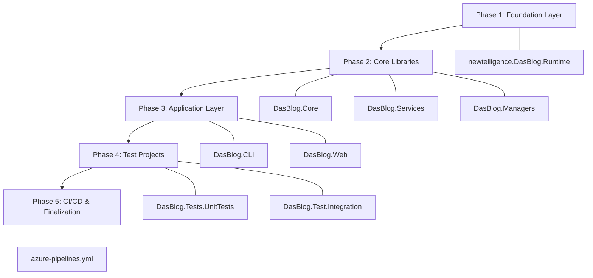

# .NET 10 Upgrade Plan — DasBlog Core

## Table of Contents

- [1. Executive Summary](#1-executive-summary)
- [2. Migration Strategy](#2-migration-strategy)
- [3. Detailed Dependency Analysis](#3-detailed-dependency-analysis)
- [4. Implementation Timeline](#4-implementation-timeline)
- [5. Detailed Execution Steps](#5-detailed-execution-steps)
- [6. Package Update Reference](#6-package-update-reference)
- [7. Project-by-Project Migration Plans](#7-project-by-project-migration-plans)
- [8. Breaking Changes Catalog](#8-breaking-changes-catalog)
- [9. CI/CD Pipeline Updates](#9-cicd-pipeline-updates)
- [10. Risk Management](#10-risk-management)
- [11. Testing & Validation Strategy](#11-testing--validation-strategy)
- [12. Complexity & Effort Assessment](#12-complexity--effort-assessment)
- [13. Source Control Strategy](#13-source-control-strategy)
- [14. Success Criteria](#14-success-criteria)

---

## 1. Executive Summary

**Upgrade**: .NET 8.0 (net8.0) → .NET 10.0 (net10.0)
**Overall Difficulty**: 🟢 Low
**Solution**: DasBlog All.sln (8 projects, all SDK-style)

| Metric | Value |
|---|---|
| Projects to upgrade | 8 |
| NuGet packages requiring action | 11 (9 upgrades, 1 removal, 1 deprecated) |
| Binary incompatible APIs | 12 occurrences |
| Source incompatible APIs | 13 occurrences |
| Behavioral changes (runtime) | 163 occurrences |
| Estimated LOC to modify | 188+ (~0.4% of codebase) |
| CI/CD changes required | 3 lines in azure-pipelines.yml |

**Approach**: Bottom-up upgrade following the project dependency graph. All projects are SDK-style, making TFM changes straightforward. No global.json exists. .NET 10 SDK is already installed.

---

## 2. Migration Strategy

### Strategy: Bottom-Up Incremental Upgrade

Upgrade projects in topological order (leaf dependencies first), building and verifying after each project. This ensures dependent projects always have their dependencies already upgraded.

**Rationale**:
- All 8 projects target `net8.0` with SDK-style project files
- No multi-targeting required
- The dependency graph is clean with no circular references
- Low overall complexity allows a single-pass upgrade

### Upgrade Sequence



---

## 3. Detailed Dependency Analysis

### Project Dependency Graph (Upgrade Order)

| Order | Project | Dependencies | Key Issues |
|---|---|---|---|
| 1 | `newtelligence.DasBlog.Runtime` | None (leaf) | 4 source incompatible + 22 behavioral |
| 2 | `DasBlog.Core` | Runtime | 1 NuGet upgrade |
| 3 | `DasBlog.Services` | Core | 1 NuGet upgrade + 4 binary incompatible + 2 source incompatible |
| 4 | `DasBlog.Managers` | Runtime, Services, Core | 71 behavioral changes |
| 5 | `DasBlog.CLI` | Services | 5 NuGet upgrades + 1 binary incompatible |
| 6 | `DasBlog.Web` | Managers, Services, CLI, Core | 6 NuGet changes + 7 binary + 6 source incompatible |
| 7 | `DasBlog.Tests.UnitTests` | Core, Web, Services, Managers | 1 source incompatible |
| 8 | `DasBlog.Test.Integration` | Web | 1 NuGet upgrade + 6 behavioral |

---

## 4. Implementation Timeline

| Phase | Projects | Commit Point |
|---|---|---|
| Phase 1 | newtelligence.DasBlog.Runtime | After build succeeds |
| Phase 2 | DasBlog.Core, DasBlog.Services, DasBlog.Managers | After build succeeds |
| Phase 3 | DasBlog.CLI, DasBlog.Web | After build succeeds |
| Phase 4 | DasBlog.Tests.UnitTests, DasBlog.Test.Integration | After tests pass |
| Phase 5 | azure-pipelines.yml + final validation | Final commit |

---

## 5. Detailed Execution Steps

### Phase 1: Foundation Layer

#### Step 1.1 — Upgrade newtelligence.DasBlog.Runtime

1. **Update TFM**: Change `<TargetFramework>net8.0</TargetFramework>` to `<TargetFramework>net10.0</TargetFramework>`
2. **No NuGet changes needed** — all packages (NodaTime 3.2.0, Microsoft.SourceLink.GitHub 8.0.0) are compatible
3. **Build and verify**
4. **Review behavioral changes**: 22 behavioral changes in `System.Uri` and `XmlSerializer` usage across:
   - `BlogDataService.cs` — `Uri` constructor usage
   - `FileSystemBinaryDataService.cs` — `Uri` operations
   - `DayEntry.cs`, `DayExtra.cs`, `Entry.cs` — `XmlSerializer` usage
5. **Commit**: `"Upgrade newtelligence.DasBlog.Runtime to net10.0"`

### Phase 2: Core Libraries

#### Step 2.1 — Upgrade DasBlog.Core

1. **Update TFM** to `net10.0`
2. **Update NuGet**: `Microsoft.Extensions.Options` 8.0.2 → 10.0.3
3. **Build and verify** — no API issues expected
4. **Commit**: `"Upgrade DasBlog.Core to net10.0"`

#### Step 2.2 — Upgrade DasBlog.Services

1. **Update TFM** to `net10.0`
2. **Update NuGet**: `Microsoft.Extensions.Options` 8.0.2 → 10.0.3
3. **Fix binary incompatible APIs** (4 occurrences in `DasBlogPathResolver.cs`):
   - `configuration.GetValue<string>("ContentDir")` → The `ConfigurationBinder.GetValue<T>` overload now requires an explicit `using Microsoft.Extensions.Configuration` and may need the `Microsoft.Extensions.Configuration.Binder` package. Ensure the project references are correct.
4. **Fix source incompatible APIs**: None in code files (only behavioral)
5. **Build and verify**
6. **Commit**: `"Upgrade DasBlog.Services to net10.0"`

#### Step 2.3 — Upgrade DasBlog.Managers

1. **Update TFM** to `net10.0`
2. **No NuGet changes needed** — all packages compatible
3. **Build and verify** — 71 behavioral changes (all `System.Uri`/`XmlSerializer` — runtime only)
4. **Commit**: `"Upgrade DasBlog.Managers to net10.0"`

### Phase 3: Application Layer

#### Step 3.1 — Upgrade DasBlog.CLI

1. **Update TFM** to `net10.0`
2. **Update NuGet packages**:
   - `Microsoft.Extensions.Configuration` 8.0.0 → 10.0.3
   - `Microsoft.Extensions.Configuration.Xml` 8.0.1 → 10.0.3
   - `Microsoft.Extensions.DependencyInjection` 8.0.1 → 10.0.3
   - `Microsoft.Extensions.DependencyInjection.Abstractions` 8.0.2 → 10.0.3
   - `Microsoft.Extensions.Options` 8.0.2 → 10.0.3
3. **Fix binary incompatible API** in `Program.cs` line 46:
   - `services.Configure<SiteConfig>(Configuration)` — The `Configure<T>(IServiceCollection, IConfiguration)` extension method signature changed. Add `using Microsoft.Extensions.Configuration` and ensure the call passes a configuration section, not the root configuration, or use the new overload.
4. **Build and verify**
5. **Commit**: `"Upgrade DasBlog.CLI to net10.0"`

#### Step 3.2 — Upgrade DasBlog.Web

1. **Update TFM** to `net10.0`
2. **Update NuGet packages**:
   - `Microsoft.AspNetCore.Identity.EntityFrameworkCore` 8.0.10 → 10.0.3
   - `Microsoft.AspNetCore.Mvc.Razor.RuntimeCompilation` 8.0.10 → 10.0.3
   - `Microsoft.VisualStudio.Web.CodeGeneration.Design` 8.0.6 → 10.0.2
3. **Remove NuGet package**:
   - `Microsoft.AspNetCore.Mvc.Razor.Extensions` 6.0.36 — functionality included in framework reference for net10.0
4. **Handle incompatible package**:
   - `Microsoft.VisualStudio.Azure.Containers.Tools.Targets` 1.21.0 — no supported version found. Check for a newer version or temporarily keep as-is (used only for Docker tooling in Visual Studio)
5. **Handle deprecated package**:
   - `Microsoft.ApplicationInsights.AspNetCore` 2.22.0 → upgrade to 3.0.0 (or consider replacing with OpenTelemetry if desired — out of scope for this upgrade)
6. **Fix binary incompatible APIs in `DasBlogServiceCollectionExtensions.cs`** (7 occurrences):
   - Lines 127-130: `services.Configure<T>(configuration)` calls — the `Configure<TOptions>(IServiceCollection, IConfiguration)` overload has changed. Pass a configuration section instead of root configuration where applicable, or add the appropriate `using` directive.
   - Line 154: `configuration.GetValue<string>("AllowedHosts")` — same `ConfigurationBinder.GetValue<T>` change.
   - Line 225: `ServiceCollectionExtensions` type — verify AutoMapper's `AddAutoMapper` usage still compiles.
7. **Fix source incompatible APIs**:
   - `DasBlogServiceCollectionExtensions.cs` line 214: `TimeSpan.FromSeconds(1000)` — In .NET 10, `TimeSpan.FromSeconds` accepts `long` instead of `double`. Integer literals compile fine; only `double` variables may need casting.
   - `DasBlogServiceCollectionExtensions.cs` line 170: `TimeSpan.FromSeconds(10000)` — same as above.
   - `DasBlogController.cs` line 29: `TimeSpan.FromMinutes(240)` — same pattern.
   - `Identity/ApplicationDbContext.cs` line 4: `IdentityDbContext` base class constructor — recompile after updating `Microsoft.AspNetCore.Identity.EntityFrameworkCore` package.
   - `DasBlogServiceCollectionExtensions.cs` line 237: `AddRazorRuntimeCompilation()` — recompile after updating the `RuntimeCompilation` package.
8. **Build and verify**
9. **Commit**: `"Upgrade DasBlog.Web to net10.0"`

### Phase 4: Test Projects

#### Step 4.1 — Upgrade DasBlog.Tests.UnitTests

1. **Update TFM** to `net10.0`
2. **No NuGet changes needed** — xunit, Moq, Microsoft.NET.Test.Sdk all compatible
3. **Fix source incompatible API**:
   - 1 occurrence of `TimeSpan.FromMilliseconds(double)` — same pattern as above
4. **Build and run tests**
5. **Commit**: `"Upgrade DasBlog.Tests.UnitTests to net10.0"`

#### Step 4.2 — Upgrade DasBlog.Test.Integration

1. **Update TFM** to `net10.0`
2. **Update NuGet**: `Microsoft.AspNetCore.Mvc.Testing` 8.0.10 → 10.0.3
3. **Build and run tests**
4. **Commit**: `"Upgrade DasBlog.Test.Integration to net10.0"`

### Phase 5: CI/CD & Finalization

#### Step 5.1 — Update azure-pipelines.yml

1. Update line 13: `version: 8.2` → `version: 10.2`
2. Update line 17: `displayName: Installing .NET 8` → `displayName: Installing .NET 10`
3. Update line 20: `version: '8.x'` → `version: '10.x'`
4. **Commit**: `"Update CI/CD pipeline for .NET 10"`

#### Step 5.2 — Final Validation

1. Full solution build
2. Run all unit tests
3. Run integration tests (if applicable)
4. Review behavioral changes at runtime if needed

---

## 6. Package Update Reference

### Packages Requiring Upgrade

| Package | Current | Target | Projects |
|---|---|---|---|
| Microsoft.Extensions.Options | 8.0.2 | 10.0.3 | CLI, Core, Services |
| Microsoft.Extensions.Configuration | 8.0.0 | 10.0.3 | CLI |
| Microsoft.Extensions.Configuration.Xml | 8.0.1 | 10.0.3 | CLI |
| Microsoft.Extensions.DependencyInjection | 8.0.1 | 10.0.3 | CLI |
| Microsoft.Extensions.DependencyInjection.Abstractions | 8.0.2 | 10.0.3 | CLI |
| Microsoft.AspNetCore.Identity.EntityFrameworkCore | 8.0.10 | 10.0.3 | Web |
| Microsoft.AspNetCore.Mvc.Razor.RuntimeCompilation | 8.0.10 | 10.0.3 | Web |
| Microsoft.VisualStudio.Web.CodeGeneration.Design | 8.0.6 | 10.0.2 | Web |
| Microsoft.AspNetCore.Mvc.Testing | 8.0.10 | 10.0.3 | Test.Integration |

### Packages Requiring Removal

| Package | Current | Reason | Projects |
|---|---|---|---|
| Microsoft.AspNetCore.Mvc.Razor.Extensions | 6.0.36 | Functionality included with net10.0 framework reference | Web |

### Packages Requiring Attention

| Package | Current | Action | Projects |
|---|---|---|---|
| Microsoft.ApplicationInsights.AspNetCore | 2.22.0 | Deprecated — upgrade to 3.0.0 | Web |
| Microsoft.VisualStudio.Azure.Containers.Tools.Targets | 1.21.0 | Incompatible — check for newer version | Web |

### Packages Compatible (No Changes Needed)

AutoMapper 13.0.1, ConsoleTables 2.6.2, Coravel 6.0.0, coverlet.collector 6.0.2, HtmlAgilityPack 1.11.71, Kveer.XmlRPC 1.3.1, MailKit 4.8.0, Markdig 0.38.0, McMaster.Extensions.CommandLineUtils 4.1.1, Microsoft.NET.Test.Sdk 17.11.1, Microsoft.Playwright 1.48.0, Microsoft.SourceLink.GitHub 8.0.0, Moq 4.20.72, NetEscapades.Extensions.Logging.RollingFile 2.5.0, NodaTime 3.2.0, NWebsec.AspNetCore.Middleware 3.0.0, Quartz.AspNetCore 3.13.1, reCAPTCHA.AspNetCore 3.0.10, xunit 2.9.2, xunit.runner.visualstudio 2.8.2, Xunit.SkippableFact 1.4.13

---

## 7. Project-by-Project Migration Plans

### newtelligence.DasBlog.Runtime.csproj

| Attribute | Value |
|---|---|
| Difficulty | 🟢 Low |
| TFM Change | net8.0 → net10.0 |
| NuGet Changes | None |
| API Issues | 4 source incompatible (TimeSpan.From*), 22 behavioral |
| Files with Issues | 8 |
| Est. LOC Impact | 26+ |

**Source Incompatible Changes**: `TimeSpan.FromMilliseconds`, `TimeSpan.FromDays` — In .NET 10, these methods now accept `long`/`int` instead of `double`. Integer literal arguments will compile fine. Only explicit `double` variable arguments require casting to the new parameter type.

**Behavioral Changes** (runtime verification recommended):
- `System.Uri` — .NET 10 changes URI parsing behavior for edge cases (RFC compliance). Test any URLs with special characters, relative paths, or encoded segments.
- `XmlSerializer` — Minor behavioral changes in serialization. Test XML round-trip operations.

### DasBlog.Core.csproj

| Attribute | Value |
|---|---|
| Difficulty | 🟢 Low |
| TFM Change | net8.0 → net10.0 |
| NuGet Changes | Microsoft.Extensions.Options 8.0.2 → 10.0.3 |
| API Issues | None |
| Files with Issues | 1 |
| Est. LOC Impact | 0 |

Straightforward TFM + package version bump.

### DasBlog.Services.csproj

| Attribute | Value |
|---|---|
| Difficulty | 🟢 Low |
| TFM Change | net8.0 → net10.0 |
| NuGet Changes | Microsoft.Extensions.Options 8.0.2 → 10.0.3 |
| Binary Incompatible | 4 (`ConfigurationBinder.GetValue<T>`) |
| Source Incompatible | 2 (`TimeSpan.FromMilliseconds`) |
| Behavioral | 42 |
| Files with Issues | 10 |
| Est. LOC Impact | 48+ |

**Key file**: `DasBlogPathResolver.cs` — 4 occurrences of `configuration.GetValue<string>(...)` that may require ensuring the `Microsoft.Extensions.Configuration.Binder` package is referenced or the correct overload is used.

### DasBlog.Managers.csproj

| Attribute | Value |
|---|---|
| Difficulty | 🟢 Low |
| TFM Change | net8.0 → net10.0 |
| NuGet Changes | None |
| API Issues | 71 behavioral only |
| Files with Issues | 4 |
| Est. LOC Impact | 71+ |

All 71 issues are behavioral changes (`System.Uri` parsing). No code modifications needed, but runtime testing recommended.

### DasBlog.CLI.csproj

| Attribute | Value |
|---|---|
| Difficulty | 🟢 Low |
| TFM Change | net8.0 → net10.0 |
| NuGet Changes | 5 packages to upgrade |
| Binary Incompatible | 1 (`Configure<T>`) |
| Behavioral | 2 |
| Files with Issues | 2 |
| Est. LOC Impact | 3+ |

**Key file**: `Program.cs` line 46 — `services.Configure<SiteConfig>(Configuration)` uses the changed `Configure<T>` overload.

### DasBlog.Web.csproj

| Attribute | Value |
|---|---|
| Difficulty | 🟢 Low |
| TFM Change | net8.0 → net10.0 |
| NuGet Changes | 3 upgrades + 1 removal + 1 incompatible + 1 deprecated |
| Binary Incompatible | 7 |
| Source Incompatible | 6 |
| Behavioral | 20 |
| Files with Issues | 8 |
| Est. LOC Impact | 33+ |

**Key file**: `DasBlogServiceCollectionExtensions.cs` — 10 issues (7 binary + 3 source):
- Lines 127-130: Five `Configure<T>(configuration)` calls
- Line 154: `GetValue<string>("AllowedHosts")`
- Lines 170, 214: `TimeSpan.FromSeconds()`
- Line 237: `AddRazorRuntimeCompilation()`

### DasBlog.Tests.UnitTests.csproj

| Attribute | Value |
|---|---|
| Difficulty | 🟢 Low |
| TFM Change | net8.0 → net10.0 |
| NuGet Changes | None |
| Source Incompatible | 1 |
| Files with Issues | 2 |
| Est. LOC Impact | 1+ |

### DasBlog.Test.Integration.csproj

| Attribute | Value |
|---|---|
| Difficulty | 🟢 Low |
| TFM Change | net8.0 → net10.0 |
| NuGet Changes | Microsoft.AspNetCore.Mvc.Testing 8.0.10 → 10.0.3 |
| Behavioral | 6 |
| Files with Issues | 2 |
| Est. LOC Impact | 6+ |

---

## 8. Breaking Changes Catalog

### 8.1 Binary Incompatible (🔴 High Priority — Must Fix)

These will cause compilation or runtime failures if not addressed.

#### `Configure<TOptions>(IServiceCollection, IConfiguration)` — 6 occurrences

**What changed**: In .NET 10, the `OptionsConfigurationServiceCollectionExtensions.Configure<TOptions>()` method signature has been updated. The method requires explicit configuration section binding.

**Files affected**:
- `DasBlog.CLI\Program.cs` line 46 (1 occurrence)
- `DasBlog.Web\DasBlogServiceCollectionExtensions.cs` lines 127-130, 166 (5 occurrences)

**Resolution**: Ensure `using Microsoft.Extensions.Configuration` is present and the correct overload is called. In most cases, passing a configuration section (e.g., `configuration.GetSection("SectionName")`) resolves the issue. If the root configuration is intentionally passed, verify the overload resolution.

#### `ConfigurationBinder.GetValue<T>(IConfiguration, string)` — 5 occurrences

**What changed**: The `GetValue<T>` extension method has been moved or its overload set has changed.

**Files affected**:
- `DasBlog.Services\FileManagement\DasBlogPathResolver.cs` lines 57, 65 (4 occurrences)
- `DasBlog.Web\DasBlogServiceCollectionExtensions.cs` line 154 (1 occurrence)

**Resolution**: Ensure the `Microsoft.Extensions.Configuration.Binder` package is referenced or that the correct `using` directives are present. The code pattern `configuration.GetValue<string>("key")` should still work after recompilation with updated packages.

#### `ServiceCollectionExtensions` type — 1 occurrence

**What changed**: Type `Microsoft.Extensions.DependencyInjection.ServiceCollectionExtensions` binary compatibility change.

**Files affected**:
- `DasBlog.Web\DasBlogServiceCollectionExtensions.cs` line 225

**Resolution**: This is related to AutoMapper's `AddAutoMapper` extension. Recompilation after updating packages should resolve this. Verify that `AutoMapper` 13.0.1 remains compatible.

### 8.2 Source Incompatible (🟡 Medium Priority — Recompile Required)

#### `TimeSpan.FromMinutes/FromSeconds/FromMilliseconds/FromDays` — 10 occurrences

**What changed**: In .NET 10, `TimeSpan.From*` methods now have overloads accepting `int`/`long` in addition to `double`. This can cause ambiguous call compilation errors when passing certain numeric types.

**Files affected**:
- `DasBlog.Web\DasBlogServiceCollectionExtensions.cs` lines 170, 214
- `DasBlog.Web\Controllers\DasBlogController.cs` line 29
- `newtelligence.DasBlog.Runtime` — multiple files
- `DasBlog.Tests.UnitTests` — 1 occurrence
- `DasBlog.Test.Integration` — multiple occurrences

**Resolution**: Integer literal arguments (e.g., `TimeSpan.FromMinutes(240)`) will automatically resolve to the `int` overload. If a `double` variable is passed, explicit casting may be needed: `TimeSpan.FromMinutes((int)myValue)`.

#### `IdentityDbContext` — 2 occurrences

**What changed**: The `IdentityDbContext` base class constructor has a source-level change in .NET 10.

**Files affected**:
- `DasBlog.Web\Identity\ApplicationDbContext.cs` line 4

**Resolution**: Update the `Microsoft.AspNetCore.Identity.EntityFrameworkCore` package to 10.0.3 and recompile. The constructor change should be transparent.

#### `AddRazorRuntimeCompilation()` — 1 occurrence

**What changed**: Method signature updated in the new package version.

**Files affected**:
- `DasBlog.Web\DasBlogServiceCollectionExtensions.cs` line 237

**Resolution**: Update `Microsoft.AspNetCore.Mvc.Razor.RuntimeCompilation` to 10.0.3 and recompile.

### 8.3 Behavioral Changes (🔵 Low Priority — Runtime Verification)

These compile and run but may produce different runtime behavior.

#### `System.Uri` — 69 occurrences

**What changed**: .NET 10 improves RFC 3986 compliance for URI parsing, which may affect edge-case URIs with special characters, relative path resolution, and encoded segments.

**Risk**: Low for this codebase — URIs are primarily blog URLs and standard HTTP endpoints.

**Recommendation**: Verify URL generation in blog posts, feed URLs, trackback URLs, and binary file paths.

#### `XmlSerializer` — 14 occurrences

**What changed**: Minor behavioral changes in XML serialization edge cases.

**Risk**: Low — used for blog data persistence (DayEntry, DayExtra, Entry, SiteConfig, MetaTags).

**Recommendation**: Verify XML round-trip operations for blog content.

#### `HttpContent` / `SetEnvironmentVariable` — 12 occurrences

**Risk**: Very low — standard usage patterns unaffected.

---

## 9. CI/CD Pipeline Updates

### File: `azure-pipelines.yml` (repository root)

Three changes required:

```yaml
# Line 13 — Build version variable (major number tracks .NET version)
# Before:
  version: 8.2
# After:
  version: 10.2

# Line 17 — Display name for SDK install step
# Before:
  displayName: Installing .NET 8
# After:
  displayName: Installing .NET 10

# Line 20 — .NET SDK version selector
# Before:
    version: '8.x'
# After:
    version: '10.x'
